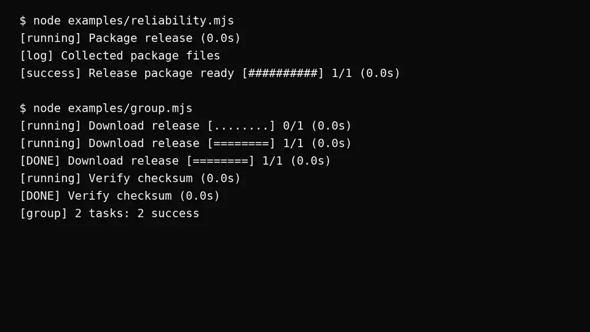

# termflow

A small, dependency-free TypeScript/ESM library for task presentation. It renders single tasks or deterministic static task groups, with safe newline-delimited records for logs, pipes, CI, and accessibility-focused output.

## Release scope

The published `0.1.0` package contains only the original single-task API. This workspace README documents the unreleased `0.3.0` package contents: the `0.1.1` reliability/output-safety additions, the `0.2.0` static task-group API, and `0.3.0` opt-in semantic coloring. No publish, release commit, or tag is created by this workspace update.

## Requirements and installation

- Node.js `>=18`
- ESM package (`"type": "module"`)
- No runtime dependencies

```sh
npm install termflow
```

## Quick start

```ts
import { createTask } from 'termflow';

const task = createTask({ message: 'Downloading release', total: 3 });
task.start();
task.setProgress(1);
task.setProgress(3);
task.succeed('Release downloaded');
```

This default configuration is plain text; it does not select a palette or emit color SGR sequences. Its final record is:

```text
[success] Release downloaded [##########] 3/3 (0.0s)
```

`createTask()` returns a `pending` task and writes nothing. Calling `start()` changes it to `running`, performs an immediate render, and returns the same task. A repeated `start()` while running is a no-op.

## Terminal output transcript

This short clip shows the direct output of the included examples:

- task-owned log passthrough;
- progress and terminal status records;
- static task-group output;
- isolated task completion and group summary;
- opt-in semantic colors for status, progress, and elapsed-time slots.



[Open the terminal output image](./assets/termflow-demo.webp)

## API

```ts
export type TaskStatus =
  | 'pending'
  | 'running'
  | 'success'
  | 'failure'
  | 'warning'
  | 'cancelled'
  | 'skipped';

export type AnsiMode = 'auto' | 'always' | 'never';

export type ColorSlot =
  | 'running'
  | 'success'
  | 'failure'
  | 'warning'
  | 'cancelled'
  | 'skipped'
  | 'spinner'
  | 'progress'
  | 'elapsed';

export type NamedColor =
  | 'black'
  | 'red'
  | 'green'
  | 'yellow'
  | 'blue'
  | 'magenta'
  | 'cyan'
  | 'white'
  | 'gray';

export type ColorSpec =
  | NamedColor
  | { ansiSgr: number | readonly number[] }
  | { ansi256: number }
  | { rgb: { r: number; g: number; b: number } }
  | { hex: string };

export type ColorTheme = Partial<Record<ColorSlot, ColorSpec>>;

export type RenderMode =
  | 'auto'
  | 'interactive'
  | 'static'
  | 'accessible'
  | 'silent';

export type PlainOutputPolicy =
  | 'all'
  | 'start-and-final'
  | 'final-only'
  | 'silent'
  | { type: 'periodic'; intervalMs: number };

export interface TaskRenderView {
  readonly status: TaskStatus;
  readonly message: string;
  readonly current: number;
  readonly total: number | undefined;
  readonly elapsedMs: number;
  readonly spinnerFrame: string;
}

export interface TaskFinalRecord {
  readonly status: Exclude<TaskStatus, 'pending' | 'running'>;
  readonly message: string;
  readonly current: number;
  readonly total: number | undefined;
  readonly elapsedMs: number;
}

export interface TaskOptions {
  message: string;
  stream?: NodeJS.WritableStream & { isTTY?: boolean; columns?: number };
  total?: number;
  current?: number;
  columns?: number;
  ansi?: AnsiMode;
  renderMode?: RenderMode;
  colors?: ColorTheme;
  spinnerFrames?: readonly string[];
  statusSymbols?: Partial<Record<TaskStatus, string>>;
  progressBar?: { complete?: string; remaining?: string; width?: number };
  format?: (view: Readonly<TaskRenderView>) => string;
  plainOutput?: PlainOutputPolicy;
  clock?: TaskClock;
  scheduler?: TaskScheduler;
}

export interface Task {
  readonly status: TaskStatus;
  readonly message: string;
  readonly current: number;
  readonly total?: number;

  start(): Task;
  update(message: string): Task;
  setProgress(current: number, total?: number): Task;
  stop(): void;
  clear(): void;
  persist(): TaskFinalRecord;
  dispose(): void;
  log(record: string): void;
  succeed(message?: string): Task;
  fail(message?: string): Task;
  warn(message?: string): Task;
  cancel(message?: string): Task;
  skip(message?: string): Task;
}

export function createTask(options: TaskOptions): Task;

export interface TaskGroupOptions {
  stream?: NodeJS.WritableStream & { isTTY?: boolean; columns?: number };
  columns?: number;
  ansi?: AnsiMode;
  renderMode?: RenderMode;
  colors?: ColorTheme;
  spinnerFrames?: readonly string[];
  statusSymbols?: Partial<Record<TaskStatus, string>>;
  progressBar?: { complete?: string; remaining?: string; width?: number };
  format?: (view: Readonly<TaskRenderView>) => string;
  plainOutput?: PlainOutputPolicy;
  clock?: TaskClock;
  scheduler?: TaskScheduler;
}

export interface TaskGroupTaskOptions {
  message: string;
  total?: number;
  current?: number;
  colors?: ColorTheme;
  statusSymbols?: Partial<Record<TaskStatus, string>>;
  progressBar?: { complete?: string; remaining?: string; width?: number };
  format?: (view: Readonly<TaskRenderView>) => string;
}

export interface TaskGroup {
  readonly tasks: readonly Task[];
  createTask(options: TaskGroupTaskOptions): Task;
  stop(): void;
  clear(): void;
  persist(): readonly TaskFinalRecord[];
  dispose(): void;
  log(record: string): void;
}

export function createTaskGroup(options?: TaskGroupOptions): TaskGroup;
```

`TaskClock`, `TaskScheduler`, and `TaskTimer` are also exported for deterministic tests and specialized runtimes. Normal callers do not need them: the default clock uses Node's monotonic `performance.now()` and the interactive timer is an unref'd Node.js interval.

### Lifecycle and validation

- `succeed`, `fail`, `warn`, `cancel`, and `skip` may transition a task from `pending` or `running`.
- Repeating the same terminal method is idempotent: it does not change the message or duplicate final output.
- A different terminal method after completion throws `Invalid task transition: <from> -> <to>.`.
- `start`, `update`, and `setProgress` reject terminal tasks and never reopen them.
- `update` and `setProgress` are allowed while pending, but do not render until the task starts.
- `current` and `total` must be finite non-negative numbers. When a total is present, `current` must be no greater than total.
- `setProgress(current, total?)` retains the previous total when `total` is omitted. Reaching `current === total` does **not** complete a task; call a terminal method explicitly.

### Reliability and output controls

For non-interactive output, `plainOutput` defaults to `'all'` for backward compatibility. Set it explicitly when CI, Docker, or redirected logs should be less verbose:

```ts
const task = createTask({
  message: 'Upload archive',
  plainOutput: 'start-and-final',
});
```

- `'all'` writes every running update and the terminal record.
- `'start-and-final'` writes one start record and one terminal record.
- `{ type: 'periodic', intervalMs }` writes a start record, changed records no more often than `intervalMs`, and the terminal record. `intervalMs` must be a finite positive number.
- `'final-only'` writes only a terminal record.
- `'silent'` writes no task records.

`stop()` stops task-owned automatic redraws without changing task state. `clear()` clears only an active termflow-owned interactive line. `persist()` returns the immutable terminal record and never writes it twice. `dispose()` releases task timers without closing or otherwise taking ownership of the configured stream; except for repeated `dispose()`, later task operations throw a lifecycle error.

`task.log(record)` writes a stable, control-character-safe `[log]` record. When an interactive task is active, termflow clears its own transient line, writes the log, and restores the task without modifying unrelated caller output.

Run `node examples/reliability.mjs` after `npm run build` for a static-output demo.

### Task groups and customization

`createTaskGroup()` is presentation-only: it creates independent task handles but never starts commands, manages processes, or schedules external work. Group tasks are rendered as deterministic static records to avoid rewriting caller-owned terminal regions; this remains stable for TTY, CI, pipes, and unknown terminal heights.

```ts
import { createTaskGroup } from 'termflow';

const group = createTaskGroup({
  renderMode: 'static',
  statusSymbols: { success: 'DONE', failure: 'FAILED' },
  progressBar: { complete: '=', remaining: '.', width: 12 },
});

const download = group.createTask({ message: 'Download release', total: 1 });
const verify = group.createTask({ message: 'Verify checksum' });

download.start().setProgress(1).succeed();
verify.start().succeed();
group.persist(); // writes one deterministic [group] summary and returns final records
```

Tasks preserve creation order in the immutable `group.tasks` snapshot; completion, failure, disposal, and records remain isolated. `group.persist()` is idempotent, requires every child to be terminal, and seals the group so no task can be added after its summary is produced. A terminal child may be disposed independently without losing its retained group record. `group.stop()`, `clear()`, and `dispose()` delegate only to task-owned renderer resources. `group.log()` emits a stable, sanitized record.

Use `spinnerFrames` on standalone tasks. Set `colors`, `statusSymbols`, `progressBar`, or `format` as group defaults or as per-group-task overrides; per-task color, symbol, and progress-bar settings merge with group defaults. Every customization object is snapshotted on construction, and spinner frames, status symbols, progress-bar characters, and color specifications are validated before rendering. A formatter receives a frozen task snapshot; its string output is sanitized and width-limited before writing. Formatter exceptions propagate to the caller, as do caller-stream write errors.

Groups deliberately use an append-only long-list strategy: every start, update, terminal transition, log, and final summary is a separate record in call order, so long task lists scroll normally instead of taking over a terminal region. Terminal height is intentionally not inspected. When `columns` is known directly or through `stream.columns`, task, log, and group-summary records are truncated to the available width.

Run `node examples/group.mjs` after `npm run build` for the group demo with inherited semantic colors.

## Rendering and ANSI modes

The default stream is `process.stderr`. Set `stream` to any writable stream you own:

```ts
const task = createTask({
  message: 'Writing report',
  stream: process.stderr,
  ansi: 'auto',
});
```

| `ansi` mode | Behavior |
| --- | --- |
| `auto` (default) | Uses an in-place TTY line only when `stream.isTTY === true` and `CI`, `NO_COLOR`, and `TERM=dumb` are absent. Explicitly configured colors use the same capability check. Otherwise it uses plain records without color. |
| `never` | Always uses plain newline-delimited records without color, including for a TTY. |
| `always` | Explicitly uses TTY-style carriage-return/ANSI clearing and spinner animation even for a non-TTY stream or when CI/`NO_COLOR`/`TERM=dumb` is present. Explicitly configured colors may be emitted to a non-TTY, but `NO_COLOR` still suppresses them. Use only when the output consumer accepts ANSI controls. |

### Opt-in semantic colors

**No color is the default contract.** Omitting `colors` emits no color SGR sequences, even with `ansi: 'auto'` on a TTY or `ansi: 'always'`. Color supplements the existing readable status text; it never replaces `[running]`, `[success]`, `[failure]`, `[warning]`, `[cancelled]`, or `[skipped]`.

Pass only the semantic slots you want to color. Unconfigured slots remain plain:

```ts
const task = createTask({
  message: 'Build release',
  total: 3,
  colors: {
    running: 'cyan',
    success: 'green',
    failure: { hex: '#E05252' },
    spinner: { ansiSgr: [1, 36] },
    progress: { ansi256: 214 },
    elapsed: { rgb: { r: 145, g: 180, b: 255 } },
  },
});
```

- Status slots style the built-in bracketed status label; `spinner`, `progress`, and `elapsed` style only their respective built-in fragments.
- Named colors are the nine `NamedColor` values listed in the API. Custom forms are structured only: `{ ansiSgr: number | number[] }`, `{ ansi256: 0..255 }`, `{ rgb: { r, g, b } }`, or `{ hex: '#RRGGBB' }`.
- RGB channels and ANSI 256 values must be integers from `0` through `255`; hex must be exactly six hexadecimal digits. `ansiSgr` accepts only the documented safe color/style parameter set (reset, intensity/italic/underline/strikethrough controls, standard/bright foreground colors, and their matching resets).
- Raw ANSI strings are deliberately not accepted. This prevents cursor movement, erase, OSC, hyperlink, newline, carriage-return, and other terminal-control injection through the color API.
- Every styled fragment emits a reset. Width truncation treats generated SGR sequences as zero-width and closes an active style before its ellipsis, so color cannot leak into subsequent caller output.

Color emission is decided in this order: no configured slots means no color; `NO_COLOR` suppresses colors; `ansi: 'never'` suppresses colors; `ansi: 'auto'` colors only a TTY outside CI and `TERM=dumb`; `ansi: 'always'` permits explicitly configured colors on any stream. `renderMode: 'accessible'` remains uncolored. A custom `format` callback receives an unstyled view and owns its final text; semantic slot colors are applied only to termflow's built-in layout.

For a static task group, group-level `colors` are snapshotted and inherited by each child. A child `colors` object overrides only its matching slots, leaving all other group slots intact.

Interactive output starts immediately and uses the ASCII frames `-`, `\`, `|`, and `/` at an 80 ms interval. It redraws one active line with `\r` and `ESC[2K`. A terminal transition stops the interval, clears/replaces that line, and writes one persistent newline-terminated final record.

Plain mode never animates and never starts a spinner timer. When no color theme is enabled, it writes no ANSI controls. `start`, running `update`, and running `setProgress` each emit a readable record. Final records are always newline-terminated. Progress uses a ten-column ASCII bar, for example `[####------] 4/10`.

`renderMode` controls presentation independently from `ansi`:

- `'auto'` is the default and selects interactive rendering only for supported streams.
- `'interactive'` requests interactive rendering only when the target supports it.
- `'static'` emits stable newline-delimited records, even with `ansi: 'always'`.
- `'accessible'` is static text output whose status remains explicit without color or animation.
- `'silent'` preserves programmatic state and records while emitting no task or task-log output.

When `columns` is provided (or a valid `stream.columns` value is available), termflow truncates safely to the visible terminal width using an ellipsis. Generated color SGR sequences have zero visible width and active styles are reset before a truncation ellipsis. Unknown widths retain the stable existing layout. All messages and log records escape terminal control characters before they are rendered.

Elapsed time is formatted as non-localized seconds with one decimal place, for example `(1.3s)`. It is measured from `start()` until the final render. A terminal task completed while pending has `(0.0s)`.

## Stream, timing, and safety semantics

termflow writes to, but never ends, destroys, closes, or otherwise takes ownership of the configured stream. It does not spawn commands, access the network, evaluate dynamic code, or install signal/log handlers.

Writes are immediate and synchronous from termflow's perspective: a `false` backpressure return value is not buffered or retried, and a synchronous stream `write()` exception is allowed to propagate to the caller rather than being silently hidden. The library does not attach an error listener to a caller-owned stream.

For safe one-line records, terminal control characters in rendered messages are escaped (for example, newline becomes `\\n` and escape becomes `\\x1b`). The public `task.message` keeps the original string.

## Limitations and deferred features

termflow supports presentation-only static task groups and small opt-in semantic colors, but does **not** implement nested groups, ETA/remaining-time estimation, resize-driven layouts, a theme engine or automatic palette selection, log buffering/interception, JSON event output, full-screen or multi-region TUI behavior, logging frameworks, process management, command execution, AI/agents, networking, databases, scheduling, file watching, plugins, or structured-event pipelines.

It is a small display primitive, not a terminal emulator, TUI framework, logger, command runner, process manager, or replacement for application-level logging.

## License

[MIT](./LICENSE)
